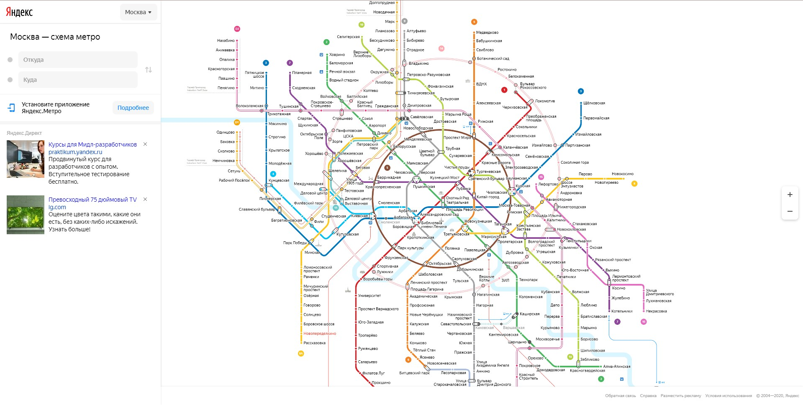
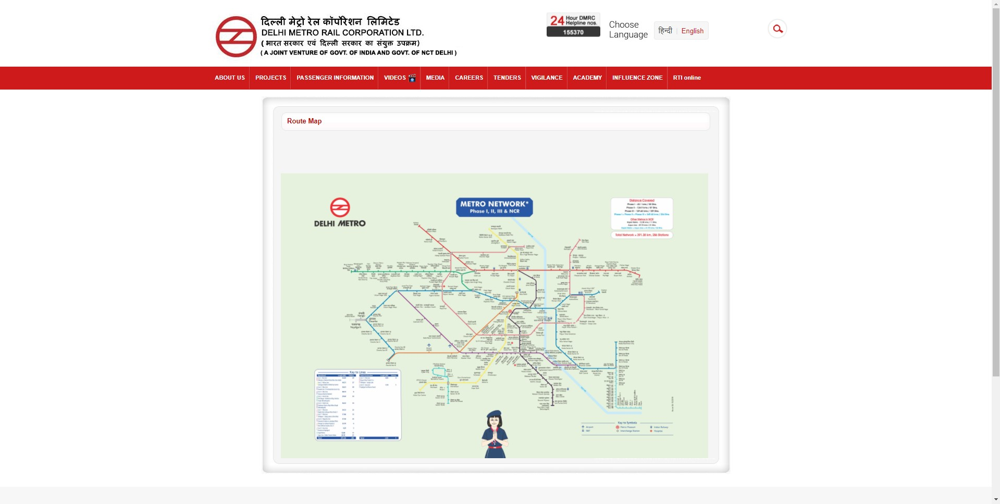

# Отчёт

## Описание
Отличие заключается в том что хороший UI в данном случае включает в себя элемент интерактивности, возможность выбора станции, масштабирования карты. Тогда как плохой пример поддерживает странное решение - масштабирование курсора, которое уменьшает как читаемость, так и возможный функционал, например данное решение не поддерживает интерактивное взаимодействие со станциями. В данном случае, плохой UI слишком сильно влияет на опыт взаимодействия пользователя с интерфейсом, т.к. интерфейс излишне неудобен и лишен дополнительного функционала. 

## Пример хорошего UI

## Пример плохого UI

## Автор
Носков Илья ИПБ-17